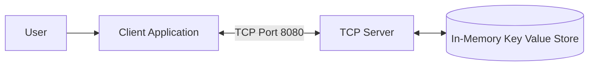
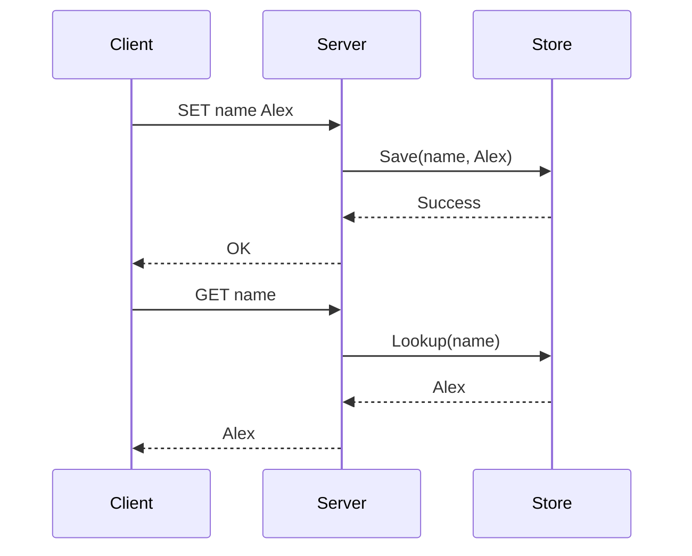

# TCP Key-Value Store

A simple Redis-inspired key-value store built using Winsock and C++.

## Architecture

```mermaid
flowchart LR

    U[User]

    C[Client Application]

    S[TCP Server]

    D[(In-Memory Key Value Store)]

    U --> C
    C <-->|TCP Port 8080| S
    S <--> D
```

## Request Flow

```mermaid
sequenceDiagram

    participant Client
    participant Server
    participant Store

    Client->>Server: SET name Alex
    Server->>Store: Save(name, Alex)
    Store-->>Server: Success
    Server-->>Client: OK

    Client->>Server: GET name
    Server->>Store: Lookup(name)
    Store-->>Server: Alex
    Server-->>Client: Alex
```
